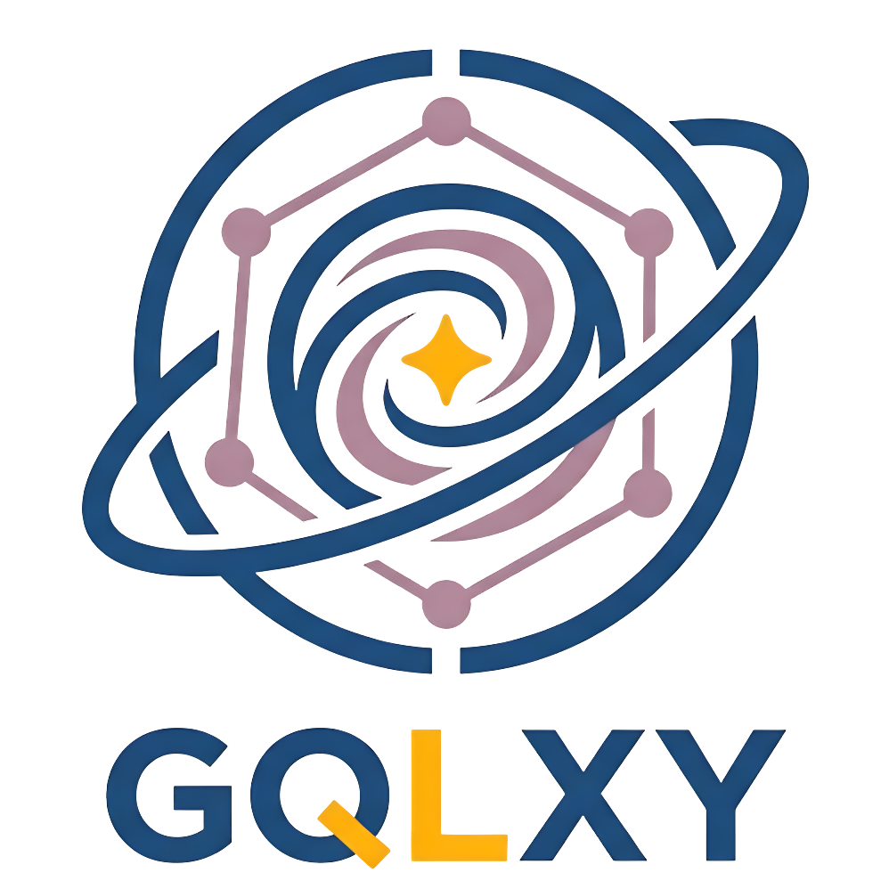

<div align="center">
  
</div>

An unopinionated C++20 GraphQL server engine.

## Why

I needed a GraphQL server in C++ for a legacy codebase. The options were quickly exhausted: `cppgraphqlgen` is complex and didn't fit my needs, `libgraphqlparser` is just a parser. Nothing resembled what Apollo does for the JavaScript ecosystem — a simple, ergonomic way to wire up a schema.

I wanted to write this:

```cpp
Schema schema({
    .typeDefs = R"(
        type Query {
            hello: String
            user: User
        }
        type User {
            id: ID!
            name: String!
            email: String!
        }
    )",
    .resolvers = {
        {"Query", Resolver{
            {"hello", "Hello, world!"},
            {"user", Resolver{
                {"id", "1"},
                {"name", "John Doe"},
                {"email", "john@example.com"}
            }}
        }}
    }
});

auto result = schema.Resolve({.query = "{ hello user { name } }"}).get();
```

So, like a normal C++ dev, I wrote it myself.

## What it is

GQLXY is a minimalist, unopinionated GraphQL execution engine for C++20. It handles SDL parsing, query execution, introspection, subscriptions, schema stitching, and Apollo Federation — without dictating how your application is structured.

It doesn't care how your server works underneath. Want sync lambdas? `std::future`? C++20 coroutines? Callbacks? Use whatever fits your codebase.

## Features

- SDL schema parsing — objects, interfaces, unions, enums, scalars, input types
- Query execution with field arguments, variables, aliases, fragments
- All four resolver styles: sync functions, `std::future`, coroutines, callbacks
- Full introspection (`__schema`, `__type`, `__typename`)
- Per-field error handling — one failing resolver doesn't abort the request
- `@skip` / `@include` and custom directives
- Custom scalars with input coercion and output serialization
- Abstract type resolution for interfaces and unions
- Serial mutation execution (spec §6.3.1)
- Query validation — undeclared variables, unknown fields, missing required arguments
- Real-time subscriptions via `PubSub`
- Schema stitching — merge multiple schemas into one
- Apollo Federation subgraph support (`@key`, `_service`, `_entities`)
- Opt-in standalone HTTP/WebSocket/SSE server

## Getting started

See [docs/getting-started.md](docs/getting-started.md).

## Documentation

| Guide | Description |
|---|---|
| [Getting Started](docs/getting-started.md) | Installation, first schema, queries, context |
| [Resolvers](docs/guides/resolvers.md) | All resolver types, lists, interfaces, unions, mutations |
| [Subscriptions](docs/guides/subscriptions.md) | PubSub, event streams, cancellation |
| [Directives & Scalars](docs/guides/directives-and-scalars.md) | Built-in and custom directives, custom scalar types |
| [Schema Stitching](docs/guides/schema-stitching.md) | Merging multiple schemas |
| [Apollo Federation](docs/guides/federation.md) | Federation subgraph protocol |
| [Standalone Server](docs/guides/standalone-server.md) | HTTP, WebSocket, and SSE transport |
| [API Reference](docs/api-reference.md) | Full type and function reference |

## License

MIT